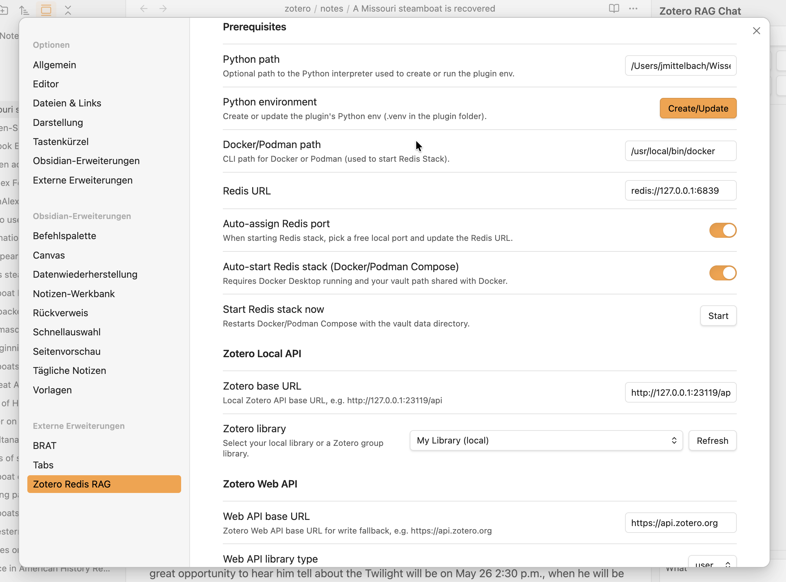

# Zotero Redisearch RAG for Obsidian

Ask questions across your Zotero library inside Obsidian. This plugin imports Zotero items, extracts PDF text (OCR when needed), indexes chunks in Redis Stack, and returns answers with citations that jump straight to the relevant chunk in your note.

> [!CAUTION]
> This plugin is early and may change. Keep backups of important notes.

## Why this plugin exists

Zotero is your source of truth for references, and Obsidian is where you think. This plugin connects them so you can ask questions over your Zotero PDFs inside Obsidian and get answers with clear, clickable citations. It imports selected items, extracts text (OCR when needed), builds a local vector index in Redis, and keeps the results linked back to your notes and PDFs.

## Highlights

- Local-first RAG over your Zotero PDFs (Redis Stack + local embeddings/chat).
- Rich Obsidian notes with chunk markers you can edit.
- Incremental reindexing: edits update only the affected chunks.
- Citations link back to the exact chunk in the note (or Zotero if you prefer).
- Chat sessions saved and exportable to notes.


## How it works

1) Pick a Zotero item in Obsidian.  
2) Docling extracts text (OCR when needed).  
3) Chunks are embedded and indexed in Redis Stack.  
4) Ask questions; responses cite the chunks used.

## Notes and syncing

Imported notes include a sync section with chunk markers (hidden in preview and rendered as badges):

- `<!-- zrr:sync-start doc_id=... -->`
- `<!-- zrr:chunk id=... -->`
- `<!-- zrr:chunk end -->`
- `<!-- zrr:sync-end -->`

You can edit chunk text directly in the note. On save, the plugin updates the cached JSON and reindexes only the changed chunks.

- In Live Preview, a hover toolbar appears on the active chunk with actions (clean, tags, indexed preview, open in Zotero, exclude/include).
- Toggle exclusion via command palette: **Toggle ZRR chunk exclude at cursor**.
- Right-click inside a chunk for the same action.

## Frontmatter template (editable)

You can edit the note frontmatter template in Settings → Output → Frontmatter template.  
Placeholders use `{{var}}` and are filled from the cached Zotero item metadata (local API or web API).

Common placeholders:
- `doc_id`, `zotero_key`, `item_link` (zotero://select link), `citekey`
- `title_quoted`, `short_title_quoted`, `publication_title_quoted`, `book_title_quoted`
- `year`, `item_type_quoted`, `doi_quoted`, `isbn_quoted`, `issn_quoted`
- `authors_list`, `editors_list`, `tags_list`, `collections_list`
- `collection_titles_quoted` (all collection titles joined with `; `)
- `collections_links_list` (collections as `[[Obsidian Links]]`)
- `pdf_link`, `item_json`

Template guidance:
- In YAML frontmatter, prefer `*_yaml` and `*_yaml_list` placeholders to avoid broken quoting.
- Use raw variables (no suffix) in the note body unless you need YAML escaping.

Suffixes:
- `*_yaml` = YAML-safe quoted string (recommended in frontmatter).
- `*_yaml_list` = YAML list (`- "item"` per line).

Obsidian links in YAML:
- Use `*_links_yaml_list` (or any `*_yaml_list` built from links) so each `[[link]]` is quoted.

Tag sanitization:
- Zotero tags can be normalized for Obsidian (replace spaces or camelCase). See Settings → Output → Tag sanitization.

Example (collections as links):
```yaml
collections:
{{collections_links_list}}
```

## Note body template (editable)

You can also customize the note body after frontmatter in Settings → Output → Note body template.

Available placeholders:
- `{{pdf_block}}` (renders `PDF: ![[...]]` or `PDF: zotero://...`, including trailing blank line)
- `{{pdf_line}}` (just the `PDF: ...` line)
- `{{docling_markdown}}` (the full synced Docling content with chunk markers)

If you omit `{{docling_markdown}}`, it will be appended to avoid losing content.

## LLM provider profiles

To avoid configuring base URL + API key in multiple places, you can define provider profiles in Settings → LLM Provider Profiles.  
Each section (Embeddings / Chat / OCR cleanup) can select a profile to populate those fields. API keys are masked in the UI and stored in plugin settings (not encrypted).

## Requirements

- Obsidian (desktop)
- Zotero 7 (desktop)
- Docker Desktop or Podman (for Redis Stack)
- LM Studio or Ollama (or any OpenAI-compatible local server) — cloud providers like OpenAI/OpenRouter also work
- Python 3.11–3.13 (for Docling tools)

## Setup

### 1) Enable Zotero local API (read-only)
In Zotero:
1) Open Settings -> Advanced.
2) Enable "Allow other applications on this computer to communicate with Zotero".
3) No API key is needed for the local API.

### 2) Install the plugin
Option A (recommended):
1) Download the latest release zip.
2) Unzip to your vault:  
   `<vault>/.obsidian/plugins/zotero-redisearch-rag/`
3) The folder must contain `main.js`, `manifest.json`, `versions.json`, and `tools/`.

Option B (BRAT, beta testing):
1) Install the BRAT plugin in Obsidian.
2) BRAT -> Add Beta plugin.
3) Enter the repo slug: `jmiba/zotero-redisearch-rag`
4) Enable the plugin in Community plugins.

Option C (build from source, power users):
```bash
npm install
npm run build
```
Then copy the plugin folder to your vault as above.

### 3) Start Redis Stack
Recommended: start from the plugin
- Command palette -> "Start Redis Stack (Docker Compose)"

Settings related to Redis (Settings → Prerequisites):
- Docker/Podman path: path to the CLI (default `docker`; set to `podman` if using Podman).
- Redis URL: `redis://127.0.0.1:6379` (updated automatically when Auto‑assign is ON).
- Auto-assign Redis port: OFF by default. When enabled, the plugin picks a free local port and updates Redis URL on start.
- Auto-start Redis stack: ON by default. The plugin will ensure the stack is running when needed.
- Start Redis stack now: button in settings to start/restart immediately.

Notes:
- Docker Desktop or Podman machine must be running (Podman uses `podman compose` or `podman-compose`).
- Your vault folder must be shared in Docker/Podman file sharing settings.
- Redis data is stored under `<vault>/.zotero-redisearch-rag/redis-data`.
- Multiple vaults:
   - Starting from the plugin creates a per‑vault Docker Compose project and data folder.
   - With Auto‑assign Redis port enabled, each vault gets a unique local port and the Redis URL is updated automatically.
   - If multiple vaults share the same Redis URL, the plugin namespaces the index and key prefix with a vault‑specific hash so they can safely share one Redis instance.

### 4) Start a model provider (LM Studio, Ollama, or cloud)

Local options
- LM Studio
   1) Open LM Studio and start the local server.
   2) Copy the model ID shown in LM Studio (not the repo name).
       Example model IDs:
       - `text-embedding-embeddinggemma-300m`
       - `text-embedding-nomic-embed-text-v1.5`
   3) Keep the server running while you use the plugin.
- Ollama
   1) Install Ollama and ensure the daemon is running (typically `ollama serve`, or it autostarts).
   2) Use the OpenAI-compatible endpoint at `http://localhost:11434/v1`.
   3) Pull models you need, e.g. `ollama pull nomic-embed-text` (embeddings) or `ollama pull llama3.1` (chat).
   4) In settings, select the Ollama provider profile (or set base URL/API key manually; API key usually blank for local).

Cloud options
- OpenAI or OpenRouter
   - In Settings → LLM Provider Profiles, add/select a profile:
      - Base URL: `https://api.openai.com/v1` (OpenAI) or `https://openrouter.ai/api/v1` (OpenRouter)
      - API key: your key from the provider
   - Then select that profile for Embeddings/Chat/OCR cleanup and choose a model via the Refresh buttons.

### 5) Python setup (Docling)
```bash
python3 -m venv .venv
source .venv/bin/activate
pip install -r requirements.txt
```
You can also create/update the Python env from the settings panel ("Python environment"):
- Creates `.venv` inside the plugin folder.
- Uses the configured Python path if valid; otherwise tries `python3`/`python` (Windows: `py -3`, then `python`).
- Installs `requirements.txt` into that venv and updates your `Python path` setting.
Optional (for stronger OCR fallback):
- Install Poppler and Tesseract on your system.
Optional (for faster native rebuilds):
- If you see a Paddle warning about missing `ccache`, install it (macOS: `brew install ccache`).

### 6) Configure the plugin
Obsidian -> Settings -> Community plugins -> Zotero Redis RAG

Key settings:
- Prerequisites
   - Python path: `/path/to/your/.venv/bin/python` (or leave blank to auto‑detect)
   - Python environment: Create/Update button to set up the plugin venv
   - Docker/Podman path: `docker` (or `podman`)
   - Redis URL: `redis://127.0.0.1:6379` (auto‑updated if Auto‑assign is ON)
   - Auto-assign Redis port: toggle (default OFF)
   - Auto-start Redis stack: toggle (default ON)
- Zotero Local/Web API: base URLs, library type/ID, and optional Web API key
- Output
   - PDF and Notes folders
   - Frontmatter template and Tag sanitization
   - Note body template
- LLM Provider Profiles
   - Define provider profiles (base URL + API key) once, then select them in Embeddings/Chat/OCR cleanup sections
- Text Embedding
   - Embeddings provider profile or manual base URL/API key
   - Embeddings model (select via Refresh)
   - Include metadata, subchunk size/overlap, optional LLM tags for chunks
- Chat LLM
   - Chat provider profile or manual base URL/API key
   - Chat model (select via Refresh), temperature, history size, panel location
- Docling / OCR cleanup
   - OCR mode and quality threshold; chunking mode
   - OCR engine selection (Tesseract/local Paddle/PaddleOCR API) and Paddle OCR API key (get a free key at https://aistudio.baidu.com/paddleocr)
   - Optional LLM cleanup (provider/profile, model, temperature, thresholds)
- Saved chats folder: where exported chat notes are stored
- Citations: Prefer Obsidian note for citations (toggle)
- Logging: enable file logging; view/clear log; log file path



## Using the plugin

1) Command palette -> "Import Zotero item and index (Docling -> RedisSearch)"
2) Command palette -> "Ask my Zotero library (RAG via RedisSearch)"
3) Command palette -> "Open Zotero RAG chat panel"

Answers are generated from retrieved text only and include citations.

### Retrieval fallback (auto-broadening)

If retrieval looks weak, the query is broadened once before the LLM runs. This is not configurable yet; the current triggers are:
- Fewer than 3 filtered chunks.
- Fewer than ~1500 characters of filtered context.
- Weak best vector match (COSINE distance > 0.4).
- Narrative filter keeps <50% of contentful chunks (when at least 4 content chunks exist).

When triggered, the search doubles `k` (minimum 12) and relaxes narrative filtering.

## PDF handling

- If "Copy PDFs into vault" is ON, the note links to the vault PDF.
- If it is OFF, the note links to the Zotero attachment (so you can see your Zotero annotations).
- If the local PDF path is unavailable, the plugin will temporarily copy the PDF into the vault for processing and tell you.
- "Create OCR-layered PDF copy" writes a new, searchable PDF (requires Tesseract + Poppler) and uses it for citations when opening PDFs.

## Web API fallback (optional)

The local API is read-only. For write-back (language field) and for fallback reads when the local API is unavailable, you can enable the Web API:
1) Create an API key at https://www.zotero.org/settings/keys
2) In settings, fill:
   - Web API base URL (default `https://api.zotero.org`)
   - Web API library type (`user` or `group`)
   - Web API library ID (numeric)
   - Web API key

If you want Web API file downloads, your Zotero library must be synced and the API key must allow file access.

## Reindexing and cache

- Command palette -> "Reindex Redis from cached chunks"
- This rebuilds the vector index without re-running Docling.

## Files created in your vault

- `zotero/pdfs/<title>.pdf` (optional if PDF copy is enabled)
- `zotero/notes/<title>.md`
- `zotero/chats/<chat-title>.md` (exported chats; folder configurable)
- `.zotero-redisearch-rag/items/<doc_id>.json`
- `.zotero-redisearch-rag/chunks/<doc_id>.json`
- `.zotero-redisearch-rag/doc_index.json`
- `.zotero-redisearch-rag/chats/index.json`
- `.zotero-redisearch-rag/chats/<session-id>.json`

## OCR options (simple summary)

- Auto: use text layer if it looks good.
- Force if bad: OCR when text quality is low.
- Force: always OCR.

You can adjust the quality threshold in settings.
If you want PaddleOCR API OCR, set the Paddle OCR API key (https://aistudio.baidu.com/paddleocr) and select a Paddle API engine (PP-StructureV3 or PaddleOCR-VL) in Settings.

## Troubleshooting

- "No such index idx:zotero": start Redis Stack and reindex cached chunks.
- "Invalid model identifier": use the exact LM Studio model ID.
- Redis data not persisting: start Redis Stack from the plugin so it uses the correct data folder.

## Advanced: batch indexing

```bash
python3 tools/batch_index_pyzotero.py \
  --library-id <id> \
  --library-type user \
  --api-key <key> \
  --redis-url redis://127.0.0.1:6379 \
  --index idx:zotero \
  --prefix zotero:chunk: \
  --embed-base-url http://localhost:1234/v1 \
  --embed-api-key lm-studio \
  --embed-model text-embedding-embeddinggemma-300m \
  --out-dir ./data \
  --ocr auto \
  --chunking page
```

## Guardrails

- Answers must be grounded in retrieved context.
- If context is insufficient, the response says it does not know.
- Citations point to the exact chunk (or Zotero when note preference is off).
