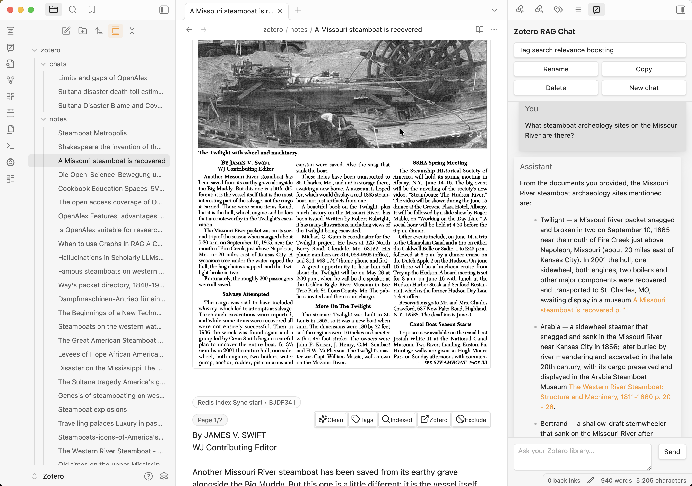
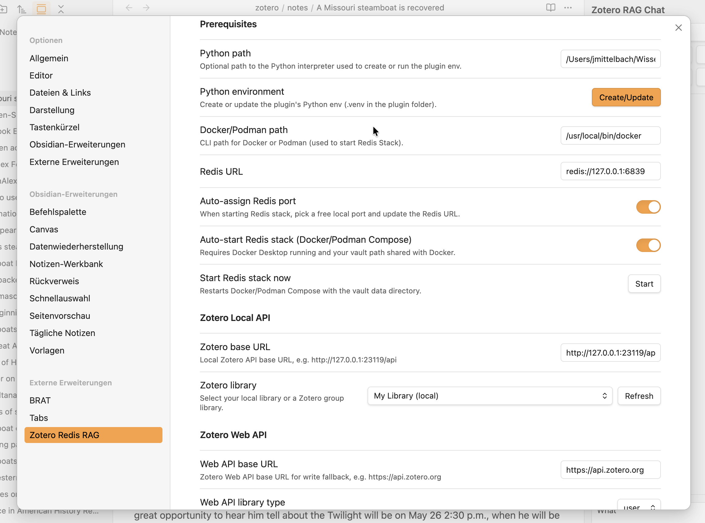

# Zotero Research Assistant for Obsidian

[](https://doi.org/10.5281/zenodo.18341648)

Ask questions across your Zotero library inside Obsidian. This plugin imports Zotero items, extracts PDF text (OCR when needed), indexes chunks in Redis Stack, and returns answers with citations that jump straight to the relevant chunk in your note.

**Documentation:** [Zotero Research Assistant docs](https://jmiba.github.io/zotero-redisearch-rag/)

## Why this plugin exists

Zotero is your source of truth for references, and Obsidian is where you think. This plugin connects them so you can ask questions over your Zotero PDFs inside Obsidian and get answers with clear, clickable citations. It imports selected items, extracts text (OCR when needed), builds a local vector index in Redis, and keeps the results linked back to your notes and PDFs.

## Highlights

- Local-first RAG over your Zotero PDFs (Redis Stack + local embeddings/chat).
- Rich Obsidian notes with chunk markers you can edit.
- Incremental reindexing: edits update only the affected chunks.
- Citations link back to the exact chunk in the note (or Zotero if you prefer).
- Chat sessions saved and exportable to notes.
- Optional chat-history query rewriting so follow-up questions can be rewritten into standalone retrieval queries before search.
- Optional agentic retrieval planner (expansion retry or full-document pull when needed).



## How it works

1) Pick a Zotero item in Obsidian.  
2) Docling extracts text (OCR when needed).  
3) Chunks are embedded and indexed in Redis Stack.  
4) Ask questions; responses cite the chunks used.

## Notes and syncing

Imported notes include a sync section with chunk markers (hidden in preview and rendered as badges):

- `<!-- zrr:sync-start doc_id=... -->`
- `<!-- zrr:chunk id=... -->`
- `<!-- zrr:chunk end -->`
- `<!-- zrr:sync-end -->`

You can edit chunk text directly in the note. On save, the plugin updates the cached JSON and reindexes only the changed chunks.

- In Live Preview, a hover toolbar appears on the active chunk with actions (clean, tags, indexed preview, open in Zotero, exclude/include).
- Toggle exclusion via command palette: **Toggle ZRR chunk exclude at cursor**.
- Right-click inside a chunk for the same action.

## Zotero sync (metadata + annotations)

The plugin syncs metadata and annotations from your Zotero library when you import or re-sync an item.

Metadata fields tracked bidirectionally are:
- `title`
- `short_title`
- `citekey`
- `date`
- `abstract`
- `doi`
- `publication_title`
- `book_title`
- `journal_abbrev`
- `publisher`
- `place`
- `issue`
- `volume`
- `pages`
- `item_type`
- `tags`
- `authors`
- `editors`

Auto-create behavior for newly populated fields:
- Zotero -> Obsidian: if a tracked field is missing in YAML and Zotero has a value, the field is created in note frontmatter.
- Obsidian -> Zotero: if a tracked core bibliographic field is newly created in the note and Zotero is empty, it is pushed to Zotero (`title`, `short_title`, `citekey`, `date`, `abstract`, `doi`, `publication_title`, `book_title`, `journal_abbrev`, `publisher`, `place`, `issue`, `volume`, `pages`, `item_type`, `authors`, `editors`).

Annotation changes update the note body, and any edits you make inside a chunk are preserved unless you remove that chunk.

For `citekey`, Zotero -> note sync always applies (including Better BibTeX-generated keys). Note -> Zotero sync writes Zotero's native `citationKey` and also updates `Citation Key: ...` in `Extra` for compatibility.

**Note:** Edits inside chunks are preserved, but deleting a chunk marker removes its sync target!

## Frontmatter template (editable)

You can edit the note frontmatter template in Settings → Output → Frontmatter template.  
Placeholders use `{{var}}` and are filled from the cached Zotero item metadata (local API or web API).

Common placeholders:
- `doc_id`, `zotero_key`, `item_link` (zotero://select link), `citekey`
- `title_quoted`, `short_title_quoted`, `publication_title_quoted`, `book_title_quoted`
- `year`, `item_type_quoted`, `doi_quoted`, `isbn_quoted`, `issn_quoted`
- `date_added`, `date_modified`
- `authors_list`, `editors_list`, `tags_list`, `collections_list`
- `collection_titles_quoted` (all collection titles joined with `; `)
- `collections_links_list` (collections as `[[Obsidian Links]]`)
- `pdf_link`, `item_json`

Template guidance:
- In YAML frontmatter, prefer `*_yaml` and `*_yaml_list` placeholders to avoid broken quoting.
- Use raw variables (no suffix) in the note body unless you need YAML escaping.

Suffixes:
- `*_yaml` = YAML-safe quoted string (recommended in frontmatter).
- `*_yaml_list` = YAML list (`- "item"` per line).

Obsidian links in YAML:
- Use `*_links_yaml_list` (or any `*_yaml_list` built from links) so each `[[link]]` is quoted.

Tag sanitization:
- Zotero tags can be normalized for Obsidian (replace spaces or camelCase). See Settings → Output → Tag sanitization.

Example (collections as links):
```yaml
collections:
{{collections_links_list}}
```

## Note body template (editable)

You can also customize the note body after frontmatter in Settings → Output → Note body template.

Default template:
`{{annotation_block}}{{docling_markdown}}`

Available placeholders:
- `{{pdf_block}}` (renders `PDF: ![[...]]` or `PDF: zotero://...`, including trailing blank line)
- `{{pdf_line}}` (just the `PDF: ...` line)
- `{{annotation_block}}` (annotation callouts)
- `{{docling_markdown}}` (the full synced Docling content with chunk markers)

If you omit `{{docling_markdown}}`, it will be appended to avoid losing content.

## LLM provider profiles

To avoid configuring base URL + API key in multiple places, you can define provider profiles in Settings → LLM Provider Profiles.  
Each section (Embeddings / Chat / OCR cleanup) can select a profile to populate those fields. API keys are masked in the UI and stored in plugin settings (not encrypted).

## Requirements

- Obsidian (desktop)
- Zotero 7 or 8 (desktop)
- Docker Desktop or Podman (for Redis Stack + Python worker)
- LM Studio or Ollama (or any OpenAI-compatible local server) — cloud providers like OpenAI/OpenRouter also work
- Optional (advanced legacy local runtime only): Python 3.11–3.13

## Security and network disclosure

- This is a **desktop-only** plugin.

### Telemetry and tracking

- The plugin has **no built-in telemetry or analytics**.
- It does **not** send usage events for tracking/marketing.

### Network and API usage

The plugin can make network/API calls only when relevant features are enabled or configured:

- Zotero Local API (`http://127.0.0.1:23119`) for local Zotero access.
- Zotero Web API (if you configure Web API fallback/write features).
- LLM provider APIs (local or cloud), depending on your selected provider profile.
- PaddleOCR API endpoints (if you choose Paddle API OCR engines).
- Container registry pulls via Docker/Podman when Redis images are missing.

### Third-party services

Depending on your configuration, the plugin may interact with:

- Zotero (local API and optionally Web API)
- LM Studio / Ollama (local model servers)
- OpenAI / OpenRouter (cloud model APIs)
- Baidu PaddleOCR API
- Docker Hub or other OCI registries (through Docker/Podman image pulls)

### External binaries and runtimes

The plugin depends on local tools installed on your system:

- Docker Desktop or Podman (for Redis Stack + Python worker startup)
- Optional (advanced legacy local runtime only): Python 3.11–3.13
- Optional (advanced legacy local runtime only): Tesseract and Poppler (worker mode includes these in the `python-worker` image)

### API key handling

- API keys are stored in Obsidian plugin settings.
- Keys are masked in the UI but are **not encrypted at rest** by this plugin.

### Paid account requirements

- The plugin itself has no paid tier and no subscription requirement.
- Some optional integrations may require paid accounts or paid usage:
  - Cloud LLM providers (for example OpenAI/OpenRouter)
  - Paid OCR/API plans where applicable
  - Docker Desktop licensing terms may apply in some commercial environments

## License

- Plugin code: **Apache-2.0** (see `LICENSE`)
- Documentation (`docs/`): **CC BY 4.0** (see `LICENSE-docs`)

## Setup

### 1) Enable Zotero local API (read-only)
In Zotero:
1) Open Settings -> Advanced.
2) Enable "Allow other applications on this computer to communicate with Zotero".
3) No API key is needed for the local API.

### 2) Install the plugin
Option A (manual release assets):
1) Download `main.js`, `manifest.json`, and `styles.css` from the latest release.
2) Place them in `<vault>/.obsidian/plugins/zotero-redisearch-rag/`.
3) Enable the plugin. Bundled helper files are written into `tools/` on first load.

Option B (BRAT, beta testing):
1) Install the BRAT plugin in Obsidian.
2) BRAT -> Add Beta plugin.
3) Enter the repo slug: `jmiba/zotero-redisearch-rag`
4) Enable the plugin in Community plugins.

Option C (build from source, power users):
```bash
npm install
npm run build
```
Then copy the plugin folder to your vault as above.

### 3) Start Redis Stack
Recommended: start from the plugin
- Command palette -> "Start Redis Stack (Docker/Podman Compose)"
- Command palette -> "Recreate Redis Stack (Pull Configured Image)" if you need to pull the pinned Redis image again and recreate the Redis service after an update
- First startup can be slow: Docker/Podman may need to pull images and build worker dependencies. This can take several minutes, and on slower networks/machines can take 10+ minutes.

Settings related to Redis (Settings → Prerequisites):
- Python runtime: defaults to `Python worker container` (recommended).
- Advanced Python runtime options: OFF by default. Enable only if you need legacy local interpreter mode.
- Docker/Podman path: path to the CLI (default `docker`; set to `podman` if using Podman).
- Redis URL: `redis://127.0.0.1:6379` (updated automatically when Auto‑assign is ON).
- Auto-assign Redis port: OFF by default. When enabled, the plugin picks a free local port and updates Redis URL on start.
- Auto-start Redis stack: ON by default. The plugin will ensure Redis + worker are running when needed.
- Start Redis stack now: button in settings to start/restart immediately.
- Legacy local switch: Settings → Maintenance → Python Runtime → Use local runtime (legacy).

Notes:
- Docker Desktop or Podman machine must be running (Podman uses `podman compose` or `podman-compose`).
- Your vault folder must be accessible to Docker/Podman (see file sharing settings in Docker/Podman).
   - macOS: paths under /Users are shared by default.
   - Windows: C:\Users\... is typically accessible via WSL2.
- Redis data is stored under `<vault>/.zotero-redisearch-rag/redis-data`.
- The bundled Redis container now uses `redis/redis-stack`, so Redis Insight is included and exposed on `http://127.0.0.1:8001` by default.
- If Auto-assign Redis port is enabled, the plugin also shifts the Redis Insight host port to a vault-specific value to avoid multi-vault conflicts.
- Multiple vaults:
   - Starting from the plugin creates a per‑vault Docker Compose project and data folder.
   - With Auto‑assign Redis port enabled, each vault gets a unique local port and the Redis URL is updated automatically.
   - If multiple vaults share the same Redis URL, the plugin namespaces the index and key prefix with a vault‑specific hash so they can safely share one Redis instance.

### 4) Start a model provider (LM Studio, Ollama, or cloud)

Local options
- LM Studio
   1) Open LM Studio and start the local server.
   2) Copy the model ID shown in LM Studio (not the repo name).
       Example model IDs:
       - `text-embedding-embeddinggemma-300m`
       - `text-embedding-nomic-embed-text-v1.5`
   3) Keep the server running while you use the plugin.
- Ollama
   1) Install Ollama and ensure the daemon is running (typically `ollama serve`, or it autostarts).
   2) Use the OpenAI-compatible endpoint at `http://localhost:11434/v1`.
   3) Pull models you need, e.g. `ollama pull nomic-embed-text` (embeddings) or `ollama pull llama3.1` (chat).
   4) In settings, select the Ollama provider profile (or set base URL/API key manually; API key usually blank for local).

Cloud options
- OpenAI or OpenRouter
   - In Settings → LLM Provider Profiles, add/select a profile:
      - Base URL: `https://api.openai.com/v1` (OpenAI) or `https://openrouter.ai/api/v1` (OpenRouter)
      - API key: your key from the provider
   - Then select that profile for Embeddings/Chat/OCR cleanup and choose a model via the Refresh buttons.

### 5) Python runtime setup (Docling)
Recommended (worker mode):

1. Keep **Settings → Prerequisites → Advanced Python runtime options** disabled (default).
2. Click **Start Redis stack now**.
3. Wait for first startup to finish (container image pulls/build steps run on first start and may take 10+ minutes).

Migration note:
- Legacy installs that previously relied on implicit local runtime defaults are migrated to worker mode automatically.
- Existing local settings are preserved and can be re-enabled with **Use local runtime (legacy)**.

Local fallback mode:

```bash
python3 -m venv .venv
source .venv/bin/activate
pip install -r requirements.txt
```
If you use local mode:
- Enable **Advanced Python runtime options**, then set **Python runtime** to `Local interpreter/venv`, or use
  **Settings → Maintenance → Python Runtime → Use local runtime (legacy)**.
- Use **Python environment → Create/Update** in settings, or the terminal commands above.
- Set **Python path** if auto-detection is incorrect.
Optional (for stronger OCR fallback):
- Install Poppler and Tesseract on your system.
Optional (for faster native rebuilds):
- If you see a Paddle warning about missing `ccache`, install it (macOS: `brew install ccache`).

### 6) Configure the plugin
Obsidian -> Settings -> Community plugins -> Zotero Research Assistant

Key settings:
- Prerequisites
   - Advanced Python runtime options: keep OFF unless you need local legacy mode
   - Python runtime: defaults to `Python worker container` (recommended)
   - Python path + Python environment: shown only when advanced local mode is enabled
   - Docker/Podman path: `docker` (or `podman`)
   - Redis URL: `redis://127.0.0.1:6379` (auto‑updated if Auto‑assign is ON)
   - Auto-assign Redis port: toggle (default OFF)
   - Auto-start Redis stack: toggle (default ON)
- Zotero Local/Web API: base URLs, library type/ID, and optional Web API key
- Output
   - PDF and Notes folders
   - Frontmatter template and Tag sanitization
   - Note body template
- LLM Provider Profiles
   - Define provider profiles (base URL + API key) once, then select them in Embeddings/Chat/OCR cleanup sections
- Text Embedding
   - Embeddings provider profile or manual base URL/API key
   - Embeddings model (select via Refresh)
   - Include metadata, subchunk size/overlap, optional LLM tags for chunks
- Chat LLM
   - Chat provider profile or manual base URL/API key
   - Chat model (select via Refresh), temperature, history size, panel location
   - Optional retrieval tuning: chat-history query rewriting, agentic retrieval, query expansion, cross-encoder reranking
- Docling / OCR cleanup
   - OCR mode and quality threshold; chunking mode
   - OCR engine selection (Tesseract/local Paddle/PaddleOCR API) and Paddle OCR API key (get a free key at https://aistudio.baidu.com/paddleocr)
   - Optional LLM cleanup (provider/profile, model, temperature, thresholds)
- Saved chats folder: where exported chat notes are stored
- Citations: Prefer Obsidian note for citations (toggle)
- Logging: enable file logging; view/clear log; log file path



## Using the plugin

1) Command palette -> "Import Zotero item and index (Docling -> RedisSearch)"
2) Command palette -> "Ask my Zotero library (RAG via RedisSearch)"
3) Command palette -> "Open Zotero Research Assistant chat panel"

Answers are generated from retrieved text only and include citations.

If **Rewrite follow-up queries** is enabled, the plugin first rewrites the current chat message into a standalone retrieval query using recent chat history. This improves multi-turn retrieval, including follow-ups in languages other than English, while keeping the original user wording for answer generation.

### Retrieval fallback (auto-broadening)

If retrieval looks weak, the query is broadened once before the LLM runs. This is not configurable yet; the current triggers are:
- Fewer than 3 filtered chunks.
- Fewer than ~1500 characters of filtered context.
- Weak best vector match (COSINE distance > 0.4).
- Narrative filter keeps <50% of contentful chunks (when at least 4 content chunks exist).

When triggered, the search doubles `k` (minimum 12) and relaxes narrative filtering.

## PDF handling

- If "Copy PDFs into vault" is ON, the note links to the vault PDF.
- If it is OFF, the note links to the Zotero attachment (so you can see your Zotero annotations).
- If the local PDF path is unavailable, the plugin will temporarily copy the PDF into the vault for processing and tell you.
- "Create OCR-layered PDF copy" writes a new, searchable PDF and uses it for citations when opening PDFs.
  - Worker runtime (default): Tesseract + Poppler are included in the `python-worker` image.
  - Local runtime: install Tesseract + Poppler on your host system.

## Web API fallback (optional)

The local API is read-only. For write-back (language field) and for fallback reads when the local API is unavailable, you can enable the Web API:
1) Create an API key at https://www.zotero.org/settings/keys
2) In settings, fill:
   - Web API base URL (default `https://api.zotero.org`)
   - Web API library type (`user` or `group`)
   - Web API library ID (numeric)
   - Web API key

If you want Web API file downloads, your Zotero library must be synced and the API key must allow file access.

## Zotero companion (annotation images)

Area/drawing annotation images are cached locally by Zotero and are not exposed via the HTTP API.
If you want those images embedded in Obsidian callouts, download the companion XPI from
Settings → Maintenance → Zotero companion.

Download XPI saves to your system Downloads folder.

Open Zotero and install the downloaded XPI (Tools → Plugins → Install from File).

Then enable it in the Obsidian plugin settings (Annotations → Zotero companion).
When annotation images are enabled, the plugin fetches image/ink annotation images during sync and stores them in `zrr-annotations` next to your notes; re-sync updates images and removes stale ones.

## Reindexing and cache

- Command palette -> "Reindex Redis from cached chunks"
- This rebuilds the vector index without re-running Docling.

## Files created in your vault

- `zotero/pdfs/<title>.pdf` (optional if PDF copy is enabled)
- `zotero/notes/<title>.md`
- `zotero/chats/<chat-title>.md` (exported chats; folder configurable)
- `.zotero-redisearch-rag/items/<doc_id>.json`
- `.zotero-redisearch-rag/chunks/<doc_id>.json`
- `.zotero-redisearch-rag/doc_index.json`
- `.zotero-redisearch-rag/chats/index.json`
- `.zotero-redisearch-rag/chats/<session-id>.json`

## OCR options (simple summary)

- Auto: use text layer if it looks good.
- Force if bad: OCR when text quality is low.
- Force: always OCR.

You can adjust the quality threshold in settings.
If you want PaddleOCR API OCR, set the Paddle OCR API key (https://aistudio.baidu.com/paddleocr) and select a Paddle API engine (PP-StructureV3 or PaddleOCR-VL) in Settings.

## Troubleshooting

- "No such index idx:zotero": start Redis Stack and reindex cached chunks.
- "Chunks cache missing for <doc_id>": open the note and run "Reindex current note from cache" to rebuild missing chunk cache from existing `zrr:chunk` markers.
- "Invalid model identifier": use the exact LM Studio model ID.
- Redis data not persisting: start Redis Stack from the plugin so it uses the correct data folder.

## Advanced: batch indexing

```bash
python3 tools/batch_index_pyzotero.py \
  --library-id <id> \
  --library-type user \
  --api-key <key> \
  --redis-url redis://127.0.0.1:6379 \
  --index idx:zotero \
  --prefix zotero:chunk: \
  --embed-base-url http://localhost:1234/v1 \
  --embed-api-key lm-studio \
  --embed-model text-embedding-embeddinggemma-300m \
  --out-dir ./data \
  --ocr auto \
  --chunking page
```

## Guardrails

- Answers must be grounded in retrieved context.
- If context is insufficient, the response says it does not know.
- Citations point to the exact chunk (or Zotero when note preference is off).
