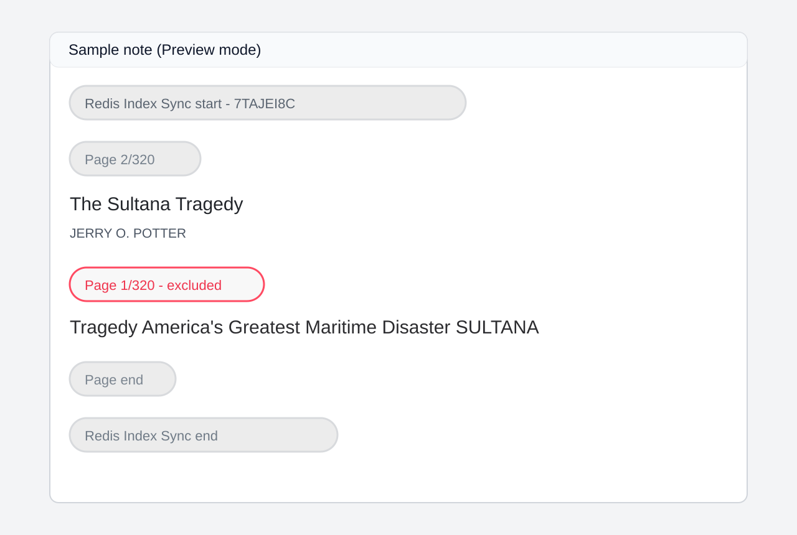
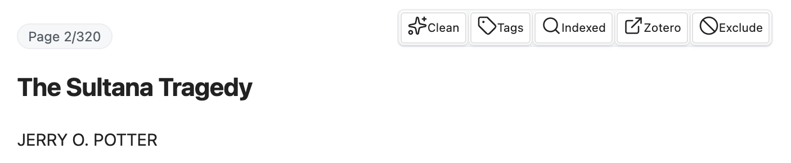

# Daily Workflow

This page describes the everyday tasks you’ll do most often.

## Import a Zotero item
1. Open the command palette.
2. Run **Import Zotero item and index (Docling → RedisSearch)**.
3. Pick an item that has a PDF attachment.

The plugin creates a note, extracts text, and indexes the chunks.

## Re‑sync metadata and annotations
Metadata and annotations are refreshed automatically when you **open** or **save** a Zotero note. This keeps the frontmatter and annotation callouts in sync with Zotero.

Synced metadata fields: `title`, `short_title`, `citekey`, `date`, `abstract`, `doi`, `publisher`, `place`, `issue`, `volume`, `pages`, `item_type`, `tags`, `authors`, `editors`.

`citekey` from Zotero always updates the note (including Better BibTeX-generated keys). Editing `citekey` in the note writes native Zotero `citationKey` and also updates `Citation Key: ...` in `Extra` for compatibility.

If you want a full refresh (including text extraction), re‑run the import command on the same item. The plugin will update the cached files and the index.

## Edit chunks safely
- You can edit text **inside** a chunk. Only the changed chunk is re‑indexed.
- Do not delete chunk markers unless you intend to remove that chunk from sync.

In source mode, chunk markers look like:

- `<!-- zrr:chunk id=... -->`
- `<!-- zrr:chunk end -->`

In live preview mode, they look like this:

## Use the chunk toolbar (Live Preview)
When your cursor is inside a chunk, a small toolbar appears. 

It lets you:

- **Clean**: Run the OCR cleanup model on the chunk.
- **Tags**: Edit chunk tags.
- **Indexed**: Preview the text that was indexed.
- **Zotero**: Open the source page in Zotero.
- **Exclude/Include**: Toggle whether the chunk is indexed.

You can also exclude/include from the command palette with **Toggle ZRR chunk exclude at cursor**.
